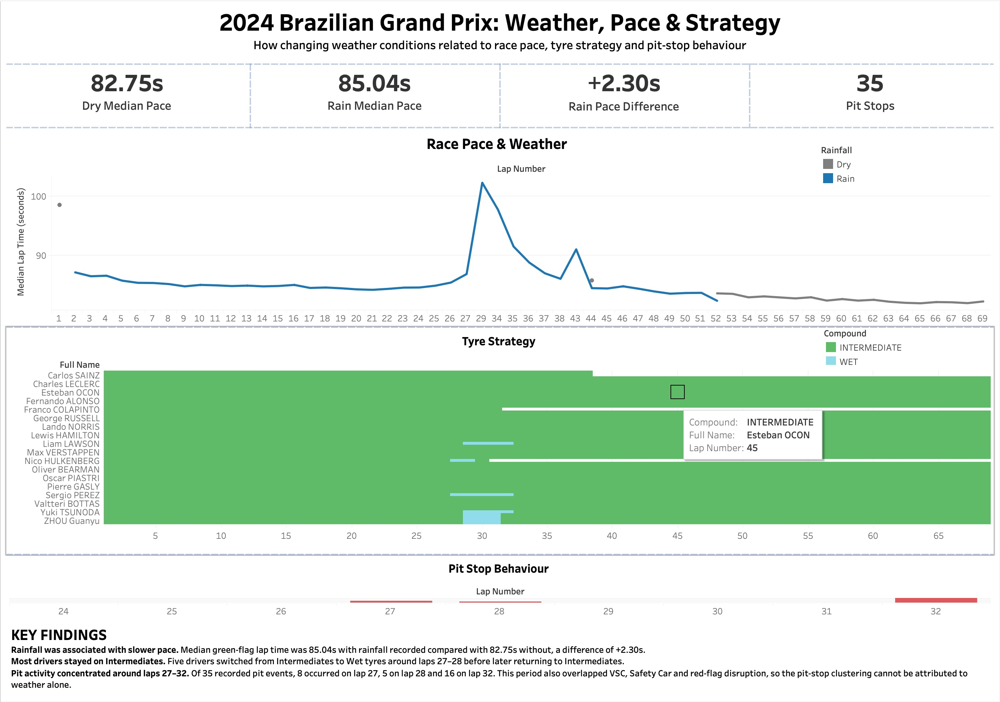

# 🏎️ F1 Weather & Race Strategy Data Pipeline

A data engineering project exploring the relationship between changing weather conditions, race pace, tyre strategy and pit-stop behaviour during the **2024 Formula 1 Brazilian Grand Prix**.

---

## 👋 About Me

Hi, I'm Mercedes. I studied Computer Science with a focus on Software Engineering, but during my degree I came across a module that introduced me to working more closely with data. I became interested in the process of taking raw data, understanding what it means and using it to answer real questions.

That experience pushed me towards more data-focused projects and eventually towards data engineering. I particularly enjoy the problem-solving involved in taking data from different sources, cleaning and transforming it, and building a structure that makes the data useful for analysis.

This project gave me an opportunity to develop those skills further while working with a subject I'm genuinely interested in.

---

## 🔎 Project Overview

Formula 1 races generate large amounts of data, but individual datasets only tell part of the story.

For this project, I built a data pipeline combining Formula 1 race data with weather data to investigate the question:

> **How were changing weather conditions related to lap pace, tyre strategy and pit-stop behaviour during the 2024 Brazilian Grand Prix?**

The aim was not only to create a dashboard, but to build the data pipeline required to turn raw API responses into a structured analytical dataset.

The pipeline covers:

- API data extraction
- Raw data preservation
- Data cleaning and transformation
- Data quality validation
- Parquet storage
- Relational modelling using DuckDB
- Time-based and range-based joins
- Race-state reconstruction
- Analytical dataset creation
- Exploratory analysis
- Tableau visualisation

---

## 💭 Why I Chose This Project

I chose Formula 1 because it is a sport I genuinely enjoy, but I was also interested in understanding what happens beyond just the cars and drivers.

A race can be influenced by many external factors, and weather is one of the most unpredictable.

I wanted to explore whether changing weather conditions were associated with differences in lap pace, tyre strategy and pit-stop behaviour during a real race. The 2024 Brazilian Grand Prix was particularly interesting because of its changing weather conditions and multiple race interruptions.

From a data engineering perspective, the project also gave me the opportunity to combine multiple APIs, work with different levels of data granularity and build a consistent analytical dataset from several independent sources.

---

## 🏗️ Pipeline Architecture

```text
             OpenF1 API                Open-Meteo API
                  │                           │
                  └─────────────┬─────────────┘
                                ▼
                           Raw JSON
                                │
                                ▼
                     Pandas Transformations
                                │
                                ▼
                       Processed Parquet
                                │
                                ▼
                             DuckDB
                                │
                                ▼
                         lap_analysis
                                │
                     ┌──────────┴──────────┐
                     ▼                     ▼
               Python Analysis       Dashboard Export
                                           │
                                           ▼
                                        Tableau
```

The project separates extraction, transformation, modelling, analysis and presentation so that each stage has a clear responsibility.

---

## 📡 Data Sources

### OpenF1

[OpenF1](https://openf1.org/) provides Formula 1 session data through an API.

For the 2024 Brazilian Grand Prix, I extracted:

- Lap data
- Driver information
- Tyre stints
- Pit stops
- Weather observations
- Race-control events

OpenF1 weather data was used for the main lap-level analysis because its observations were sufficiently granular to associate weather conditions with individual laps.

### Open-Meteo

[Open-Meteo](https://open-meteo.com/) historical weather data was used as a second independent weather source.

The extracted variables included:

- Air temperature
- Relative humidity
- Precipitation
- Rain
- Wind speed

The historical Open-Meteo data available for the project was hourly. This made it useful as contextual weather information, but too coarse for the main lap-level analysis.

Recognising this difference in granularity was an important part of deciding how each source should be used.

---

# ⚙️ Data Pipeline

## 1. Extraction

API extraction is handled by scripts inside:

```text
src/extract/
```

The API responses are stored as raw JSON before any transformation takes place.

```text
API
 ↓
Raw JSON
 ↓
Transformation
```

Keeping the raw response separate from processed data means transformations can be rerun without needing to request the API data again.

The extraction scripts also check whether the requested raw file already exists before making another API request. This reduces unnecessary requests and helped avoid API rate-limit issues during development.

---

## 2. Transformation

Transformation scripts are stored in:

```text
src/transform/
```

Each OpenF1 dataset is transformed independently before being loaded into the analytical database.

The main transformations include:

```text
drivers.py
laps.py
stints.py
pit_stops.py
openf1_weather.py
race_control.py
race_status.py
weather.py
```

During transformation I:

- Selected fields relevant to the analysis
- Standardised timestamps to UTC
- Checked candidate keys
- Checked for duplicate records
- Examined missing values
- Created data-validity flags
- Standardised schemas
- Converted processed datasets to Parquet

Instead of automatically deleting incomplete records, I created validity flags where appropriate.

For example:

```text
valid_for_pace
valid_for_weather
valid_for_strategy
valid_stop_duration
```

This allows the pipeline to preserve legitimate source records while controlling whether they are appropriate for a particular analysis.

---

## 3. Race-State Reconstruction

One challenge became apparent while analysing lap times.

Some unusually slow laps occurred during:

- Virtual Safety Car periods
- Safety Car periods
- Red flags

Comparing these directly with normal racing laps could make the weather analysis misleading.

Race-control data is event based rather than being provided as continuous race-state periods, so I transformed the events into a race-state timeline.

For example:

```text
NORMAL
  ↓
VSC
  ↓
NORMAL
  ↓
SAFETY_CAR
  ↓
RED_FLAG
```

Each state was converted into a period with:

```text
start_time
end_time
race_state
```

Rather than manually hard-coding the interruption times, the final transformation derives them from the race-control events.

This made it possible to determine whether each driver's lap interval overlapped a neutralised race period.

---

## 4. DuckDB Data Modelling

The processed Parquet datasets are loaded into **DuckDB**.

The central analytical table is:

```text
lap_analysis
```

Its grain is:

> **One row per driver per lap**

The final model contains **1,137 driver-lap records**, and the grain is validated after the joins to ensure that records have not accidentally been duplicated.

Different datasets required different joining strategies.

### Equality joins

Driver information can be matched using identifiers such as:

```text
session_key + driver_number
```

### Range joins

A tyre stint applies across a range of laps, so a lap is matched where:

```text
lap_number BETWEEN lap_start AND lap_end
```

### ASOF joins

Weather observations and laps do not share a common ID.

Instead, each lap is matched to the most recent weather observation available at or before the start of the lap.

This is implemented using a time-based **ASOF join**.

A weather-validity check prevents observations that are too far away from the lap timestamp from being treated as reliable matches.

### Interval overlap

Neutralised race periods also required time-based logic.

Each lap is treated as an interval:

```text
lap start → lap end
```

The model checks whether that interval overlaps a non-normal race-state period.

This allowed laps affected by a VSC, Safety Car or red flag to be identified without removing them from the underlying dataset.

---

## 5. Analytical Dataset

After modelling and validation, the final analytical table is exported as both:

```text
Parquet
CSV
```

The Parquet version preserves a compact analytical dataset, while the CSV export is used as the source for the Tableau dashboard.

The final model includes information such as:

- Driver
- Lap number
- Lap time
- Tyre compound
- Tyre stint
- Pit-stop status
- Weather
- Rainfall
- Race neutralisation
- Data-validity indicators

---

# 📊 Analysis

Python analysis scripts are stored in:

```text
src/analysis/
```

These explore three main relationships:

```text
weather_vs_pace.py
weather_vs_tyres.py
weather_vs_pit_stops.py
```

---

## 🏁 Weather vs Pace

For the clean pace comparison, I excluded laps that were:

- Invalid for pace analysis
- Missing a valid weather match
- Pit-stop laps
- Pit-out laps
- Affected by race neutralisation

Median lap time was used because it is less sensitive than the mean to unusually slow laps.

### Results

| Weather State        | Driver-Laps | Median Lap Time |
| -------------------- | ----------: | --------------: |
| No rainfall recorded |         298 |   82.75 seconds |
| Rainfall recorded    |         662 |   85.04 seconds |

Median lap time was approximately:

**+2.30 seconds slower when rainfall was recorded.**

This is an association rather than proof that rainfall alone caused the difference. Other factors such as tyre age, fuel load, traffic, track evolution and race strategy may also affect lap time.

---

## 🛞 Weather vs Tyre Strategy

Across the strategy-valid driver-laps:

| Compound     | Driver-Laps |
| ------------ | ----------: |
| Intermediate |       1,116 |
| Wet          |          18 |

Intermediate tyres dominated the race.

Five drivers switched from Intermediate to Wet tyres around laps 27-28 before later returning to Intermediates.

All observed Wet tyre usage occurred while rainfall was recorded by the matched OpenF1 weather observations.

An important modelling detail was distinguishing a **new stint** from a **change of compound**. A driver can start another stint using the same tyre compound, so the two concepts should not be treated as equivalent.

---

## 🔧 Pit-Stop Behaviour

The dataset contains **35 recorded pit events**.

Pit activity was particularly concentrated around laps **27-32**.

Notable counts include:

| Lap | Pit Events |
| --: | ---------: |
|  27 |          8 |
|  28 |          5 |
|  32 |         16 |

All 35 recorded pit events were matched to observations where rainfall was recorded.

However, this section of the race also overlapped with VSC, Safety Car and red-flag disruption. The clustering therefore cannot be attributed to weather alone.

The red flag also produced unusually long recorded pit-lane durations for several drivers. Rather than treating these as normal pit-stop performance or deleting them, I preserved the source records and accounted for the race context when interpreting them.

---

# 📈 Tableau Dashboard



The final analytical dataset was visualised using **Tableau**.

The dashboard contains:

### Race Pace & Weather

Median lap time across the race with laps separated by rainfall state.

### Tyre Strategy

Driver-by-driver tyre compound usage throughout the race.

### Pit-Stop Behaviour

The number of recorded pit events by lap.

### Key Metrics

- Dry median pace: **82.75s**
- Rain median pace: **85.04s**
- Median pace difference: **+2.30s**
- Recorded pit events: **35**

The dashboard is designed as the final presentation layer of the pipeline rather than the primary focus of the project.

---

# 🧹 Data Quality Decisions

A major part of this project involved deciding what **not** to change.

Some source records contain missing or unusual values that represent genuine uncertainty or unusual race conditions.

Examples include:

- Missing lap timestamps
- Missing lap durations
- Incomplete stint boundaries
- Missing pit-stop duration measurements
- Pit durations distorted by the red flag
- Neutralised racing laps
- Weather observations recorded at different timestamps from lap events

Rather than deleting every incomplete record, the pipeline preserves the data and uses validity flags and contextual filtering where appropriate.

This keeps the processed datasets closer to the source while allowing the analytical layer to select records suitable for each question.

---

# 📁 Project Structure

```text
f1-weather-pipeline/
│
├── data/
│   ├── raw/
│   ├── processed/
│   │   ├── analysis/
│   │   ├── openf1/
│   │   └── weather/
│   └── warehouse/
│
├── src/
│   ├── analysis/
│   │   ├── inspect_race_control.py
│   │   ├── weather_vs_pace.py
│   │   ├── weather_vs_pit_stops.py
│   │   └── weather_vs_tyres.py
│   │
│   ├── export/
│   │   └── dashboard_data.py
│   │
│   ├── extract/
│   │   ├── openf1.py
│   │   └── weather.py
│   │
│   ├── load/
│   │   └── duckdb_setup.py
│   │
│   └── transform/
│       ├── drivers.py
│       ├── laps.py
│       ├── openf1_weather.py
│       ├── pit_stops.py
│       ├── race_control.py
│       ├── race_status.py
│       ├── stints.py
│       └── weather.py
│
├── .gitignore
├── requirements.txt
└── README.md
```

Raw API data and the local DuckDB warehouse are excluded from Git version control.

---

# 🧰 Technologies Used

| Technology        | Purpose                                   |
| ----------------- | ----------------------------------------- |
| Python            | Pipeline development and analysis         |
| Pandas            | Cleaning and transformation               |
| Requests          | API extraction                            |
| PyArrow / Parquet | Processed data storage                    |
| DuckDB            | Data modelling and analytical queries     |
| OpenF1 API        | Formula 1 race data                       |
| Open-Meteo API    | Historical weather data                   |
| Tableau           | Dashboard and visualisation               |
| Git / GitHub      | Version control and project documentation |

---

# ▶️ Running the Project

## 1. Clone the repository

```bash
git clone https://github.com/manegbeh/f1-weather-pipeline.git
cd f1-weather-pipeline
```

## 2. Create a Python environment

For example, using Conda:

```bash
conda create -n f1-weather python=3.12
conda activate f1-weather
```

## 3. Install dependencies

```bash
pip install -r requirements.txt
```

## 4. Extract the data

```bash
python src/extract/openf1.py
python src/extract/weather.py
```

## 5. Transform the datasets

```bash
python src/transform/laps.py
python src/transform/stints.py
python src/transform/pit_stops.py
python src/transform/drivers.py
python src/transform/openf1_weather.py
python src/transform/weather.py
python src/transform/race_control.py
python src/transform/race_status.py
```

## 6. Build the DuckDB model

```bash
python src/load/duckdb_setup.py
```

## 7. Run the analysis

```bash
python src/analysis/weather_vs_pace.py
python src/analysis/weather_vs_tyres.py
python src/analysis/weather_vs_pit_stops.py
```

## 8. Export dashboard data

```bash
python src/export/dashboard_data.py
```

The resulting analytical dataset can then be connected to Tableau.

---

# 🧠 What I Learned

This project taught me that building a useful dataset involves much more than successfully retrieving data from an API.

Some of the most important lessons were:

- Data sources can describe the same event at very different levels of granularity.
- Understanding the grain of a table is essential before joining datasets.
- Not every relationship can be represented with a standard equality join.
- Time-based data may require ASOF joins or interval-overlap logic.
- Missing values should be understood before deciding whether to remove them.
- Preserving raw data makes transformations reproducible.
- Validation after joins is essential for detecting accidental duplication.
- Outliers can reveal missing context rather than simply being "bad data".

One example was the unusually slow laps that initially appeared in the pace analysis. Investigating them led me to incorporate race-control data and model VSC, Safety Car and red-flag periods rather than simply removing the slow laps.

---

# 🚀 Future Improvements

The current project focuses on a single race, but the pipeline could be extended to:

- Process multiple races automatically
- Compare wet and dry races across a full season
- Parameterise race and session selection
- Orchestrate pipeline stages automatically
- Add automated data-quality tests
- Compare weather effects across circuits
- Model additional factors such as tyre age and track evolution
- Store historical race data in a larger analytical warehouse

These improvements would allow the project to develop from a single-race analytical pipeline into a reusable Formula 1 data platform.
